---

# *SWEET HOME accommodation*

SWEET HOME accommodation services is a web-site where you can find awesome places for short-term stay in Ireland and abroad provided by people who have free property to accommodate guests and want to earn a little money on it.

The site can be accessed by this [link](https://accommodation-02410f422b40.herokuapp.com/)

---
## User Stories

### First Time Visitor Goals:

* As a First Time Visitor, I want to easily understand the main purpose of the site. So I can read about type of organization and services provided.
* As a First Time Visitor, I want to be able easily navigate through the website, so I can find the content required.
* As a First Time Visitor, I want to see some details like descriptions and prices to compare it with the others.

### Returning Visitor Goals:

* As a Returning Visitor and potential SWEET HOME accommodation services site user I can Register on this site so I can Sign In into it and Logout from there.
* As a Returning Visitor and real estate owner I can fill in a form with details about my property to propose it everyone.
* As a Returning, registered and logged in user I can see full list of my own real estate, separated by each individual property with their details.

### Frequent Visitor Goals:

* As a Frequent and registered user I can edit property details added by me earlier so that I can update all info regarding each of my property.
* As a Frequent and registered user I can delete property I added before so that I can do it for each of my property separately.

## Features

+ ### Navbar

+ ##### Navigation
    - Positioned at the top of the page.
    - Contains image logo of the SWEET HOME accommodation on the left side.
    - Contains navigation links:
        * HOME - leads to the Home page.
        * ABOUT - link to About page to read the info about site using.
        * REGISTER - leads to the page where users can Register to use site services.
        * LOGIN - leads to Login page where users can enter to the site and see additional pages.
        * ADD PROPERTY - page that appears after logging in with the form for property owners.
        * MY PROPERTY - page that appears after logging in that display property owner's full property list.
        * LOGOUT - leads to Logout page where users can exit from their profile.
    - Contains Search form in the center.
    - Contains logging status of user on the right side.

    

    - The navigation bar is responsive:
        * On mobile devices: 
            - navigation bar filled with the logo at the left and a hamburger menu implemented on the right side of the navigation bar.      
            
        
            - When the hamburger menu is clicked, there is dropdown menu with the links in the same order.
            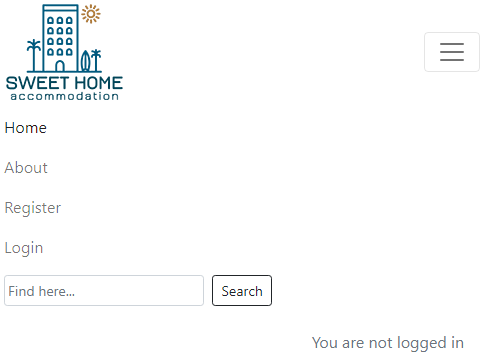
    
    - After logging in navigation bar is look like as follow.
        * Desktop:
              
        * On mobile devices:

            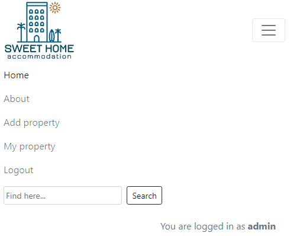
---

+ ### Home Page

    - Represent: 

        * Paginated by 6 cards and displayed by descending time adding property with short presentation with the grid 3x2 size.
        * Each card conatains: photo of property or placeholder site-logo image, price, title and description beginning text. Also date and time adding.
        * Links to Previous or Next pages with depending on where user is.
        * It has a footer that contains social media links that open in a new tab.
​
    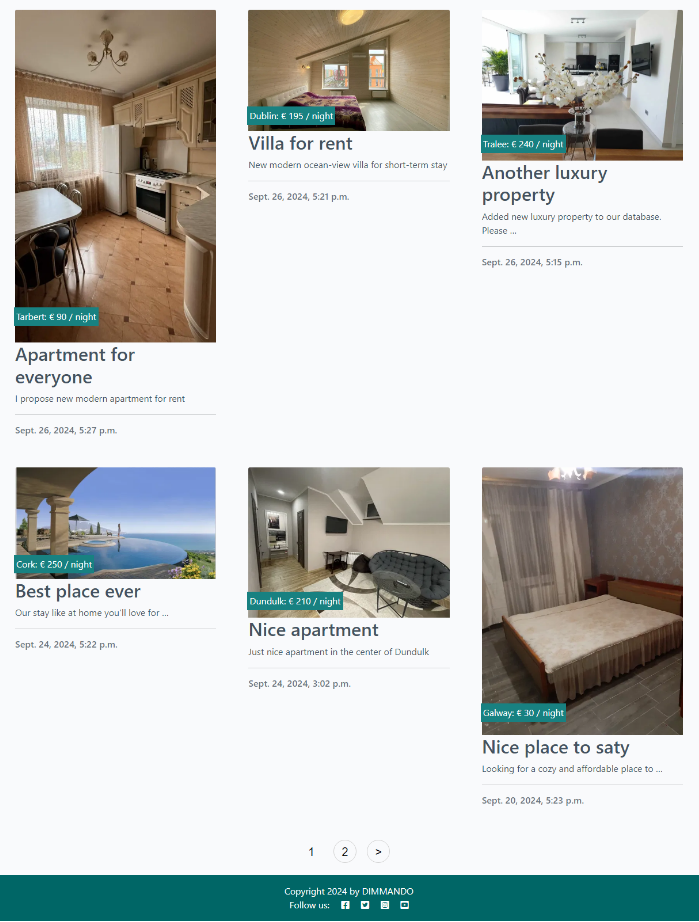

---

+ ### About page

    - The About page contains all the information needed to understand what site is about and how to use it.

    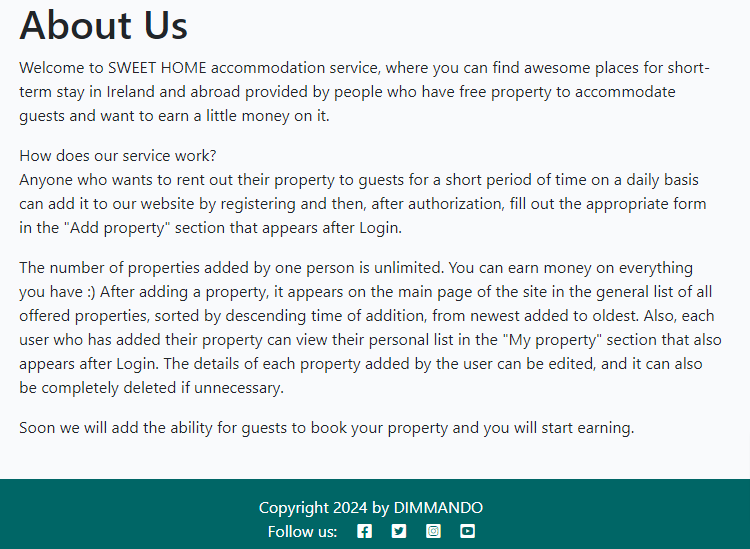

--- 

+ ### Register page

    - The Register page contains form for input visitor's desired Username, E-mail (optional) and Password to register them as the site users.

    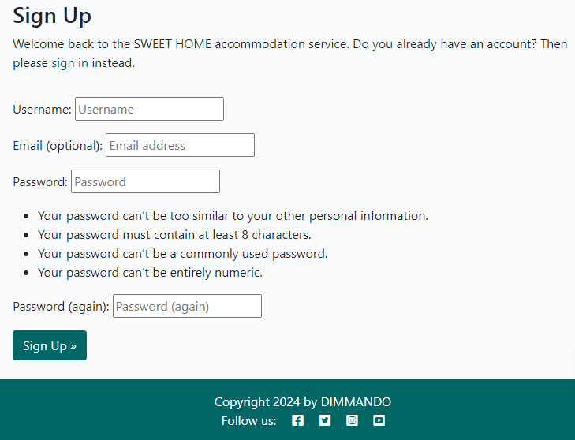

--- 

+ ### Login page

    - The Login page allow registered user enter the site by filling Username and Password.

    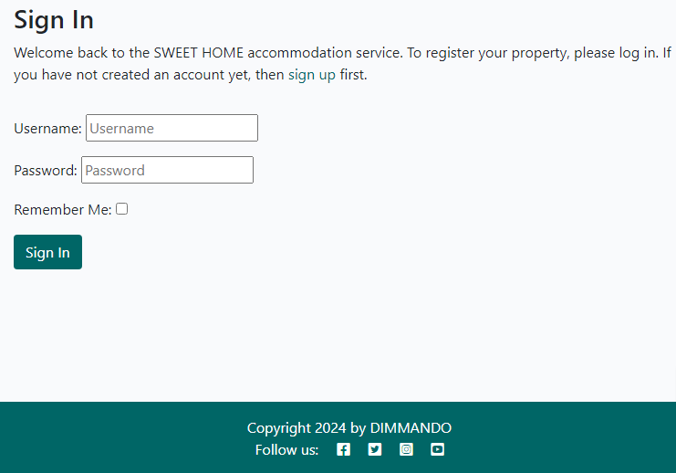

--- 

+ ### Logout page

    - The Logout page allow registered user exit the site.

    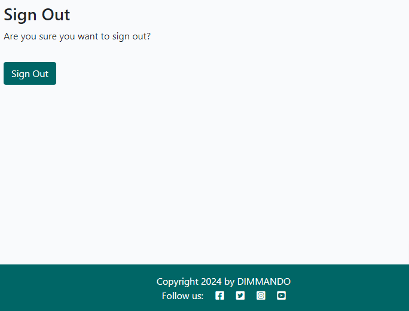

--- 

+ ### Add property page

    - Add property page has a form to provide details of user's property.
    - Form is checking correct phone input with international formatting.
    - It's allowed for user do not add their property photo. The site adds its logo as placeholder instead.
    - The Add Property! button when pressed and form is submitted leads to the detailed view of property added by user.
 
    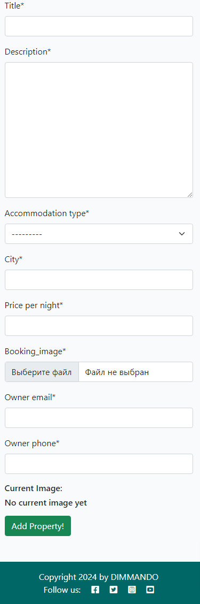

---

+ ### Detailed view page

    - Detailed view page allow read details of user's added property.
    - Detailed view page has a buttons that allow Edit details or Delete user's property.
 
    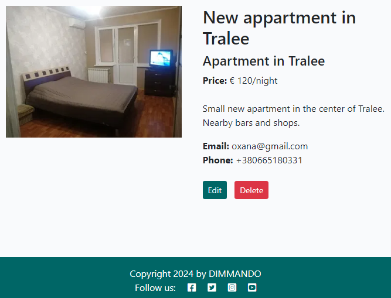

---

+ ### Detailed view page without registering or logging

    - Detailed view page without registering or logging accessible from homepage by clicking on any property. 
    - Detailed view page without registering or logging doesn't have buttons Edit or Delete.
    - Detailed view page without registering or logging encourage people to register and login so see at least property owner's contact details: E-mail and Phone number.
 
    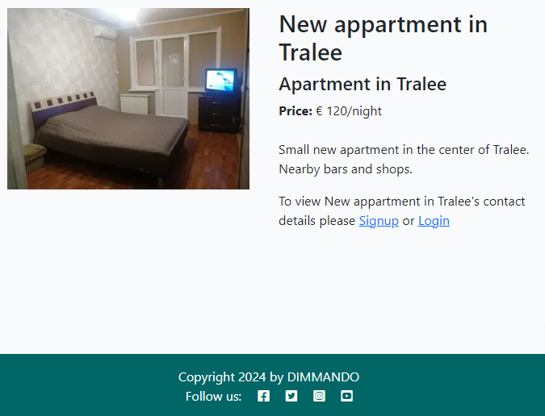

---

+ ### My property page

    - My property page contains full list of all real estate added by exact user with description. 
    - Each property in this list has buttons Edit or Delete to edit current details or delete property correspondingly.
 
    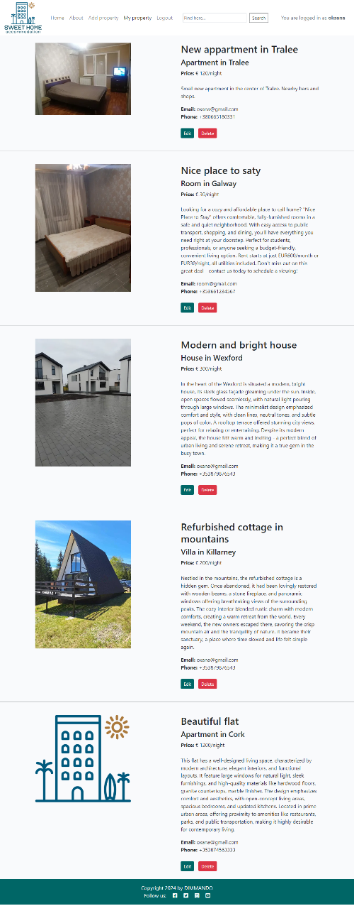

---

+ ### Edit page

    - Edit page has the same form that user experienced when was adding property. 
    - Edit page form is prepopulated with the data from current property description that relates what property user is editing.
 
    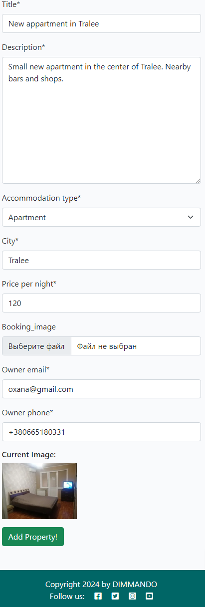

---

+ ### Delete page

    - Pressing the button Delete user is transferred to the confirmation page where their have to confirm deleting property or to Cancel deleting. 
 
    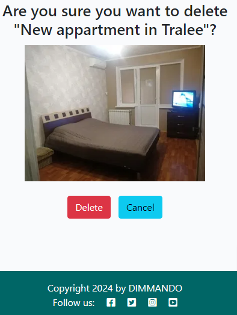

---

## Future features

- For consumer of accommodation services possibility to book a property added by users who have proposed it for short-term rent, pay for it and send information messages by E-mail for both sides.

---

## Technologies Used

- [HTML](https://developer.mozilla.org/en-US/docs/Web/HTML) - was used as the foundation of the site.
- [CSS](https://developer.mozilla.org/en-US/docs/Web/css) - was used to add the styles and layout of the site.
- [JavaScript](https://developer.mozilla.org/en-US/docs/Web/JavaScript) - was used to integrate Bootstrap and create interactive messages for the user.
- [Python](https://www.python.org/) - used this programming language as foundation principles to work with Django framework.

## Frameworks & Programes Used

- [Django](https://www.djangoproject.com/) - was used as core framework and basis for this project.
- [Cloudinary](https://cloudinary.com/) - was used to store the images.
- [PostgreSQL](https://www.postgresql.org//) - was used to store the database.
- [Bootstrap](https://en.wikipedia.org/wiki/Bootstrap_(front-end_framework)) - was used to style the site.
- [Google fonts](https://fonts.google.com) - Google fonts were used to import Roboto and Lato fonts which is used on all pages throughout the project
- [Font Awesome](https://fontawesome.com) - Font Awesome was used on footer of the pages throughout the website to add icons for aesthetic and UX purposes.

## Libraries

- asgiref - A standard Python library to allow for asynchronous web apps and servers to communicate with each other.
- cloudinary - A Python package allowing integration between the application and Cloudinary.
- dj-database-url - A Django utility to utilise the DATABASE_URL environment variable to configure the Django application. Used with PostgreSQL.
- dj3-cloudinary-storage - A Django package that facilitates integration with Cloudinary storage.
- Django - A python package for the Django framework.
- django-allauth - An integrated set of Django applications addressing user authentication, registration and account management.
- django-crispy-forms - A Django package that provides tags and filters to control the rendering behaviour of Django forms.
- django-autoslug - To create paths on the go.
- crispy-bootstrap5 - To style Crispy Forms.
- gunicorn - A Python WSGI HTTP Server for UNIX.
- psycopg2 - A PostgreSQL database adapter for Python.
- django-phonenumber-field and django-phonenumbers - To control user's phone number input in form.
- oauthlib - A generic, spec-compliant, thorough implementation of the OAuth request-signing logic for Python 3.6+.
- requests-oauthlib - Library is an extension of the popular requests library for Python, integrates OAuth 1.0 and OAuth 2.0 authorization mechanisms into HTTP requests.
- PyJWT - A Python library that allows for encoding and decoding of JSON Web Tokens (JWT).
- sqlparse - A non-validating SQL parser for Python.
- urllib3 - HTTP client library for Python. It is used to make HTTP requests to interact with web services or APIs. 
- whitenoise - Python library that serves static files with Heroku.
- python3-openid - Python 3 package that provides support for the OpenID authentication protocol.

## Other tools

- [Git](https://git-scm.com/) - Git was used for version control by utilizing the Gitpod terminal to commit to Git and push to GitHub
- [GitHub](https://github.com/) - GitHub was used to store the project's code after being pushed from Git
- [Heroku](https://id.heroku.com) - Heroku was used to deploy the live project
- [Lucidchart](https://lucid.app/) - was used to design the database schema
- [Awesome Screenshot](chrome-extension://nlipoenfbbikpbjkfpfillcgkoblgpmj/option-react.html) - Chrome extension was used to making screenshots 

---
## Design

### Color Scheme

- Color scheme of the site:
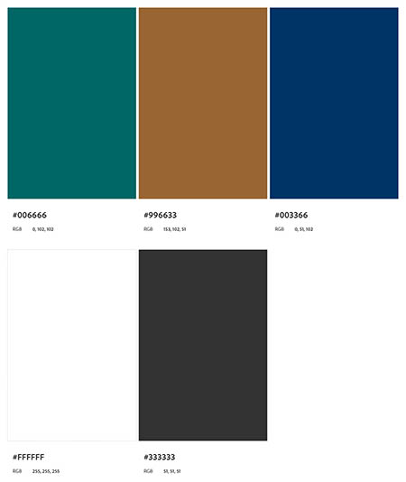

### Typography

- Roboto Google Font was used as the main font of the website in order to increase readability and beautyfication of the content on the pages.

- Lato Google Font was used as the secondary font of the website in order to increase readability and beautyfication of the content on the pages.

### Wireframes

#### Mobile devices

- [Home Page. Mobile Screen](documentation/mobile_home_page.jpg)
- [Gallery Page. Mobile Screen](documentation/mobile_gallery_page.jpg)
- [Contact Page. Mobile Screen](documentation/mobile_booking_page.jpg)
- [Response Page. Mobile Screen](documentation/mobile_response_page.jpg)

#### Tablets/Desktop

- [Home Page. Tablet/Desktop Screen](documentation/tablet_home_page.jpg)
- [Gallery Page. Tablet/Desktop Screen](documentation/tablet_gallery_page.jpg)
- [Contact Page. Tablet/Desktop Screen](documentation/tablet_booking_page.jpg)
- [Response Page. Tablet/Desktop Screen](documentation/tablet_response_page.jpg)

---

## Testing

Please refer to the [TESTING.md](TESTING.md) file for all test-related documentation.

---
## Deployment

- The program was deployed to [Heroku](https://heroku.com).
- The program can be reached by the [link](https://accommodation-02410f422b40.herokuapp.com/)

### To deploy the project as an application that can be **run locally**:

*Note:*
  1. This project requires you to have Python installed on your local Linux PC:
  - `sudo apt install python3`

  2. You will also need pip installed to allow the installation of modules the application uses.
  - `sudo apt install python3-pip`

Create a local copy of the GitHub repository by following one of the two processes below:

- Download ZIP file:
  1. Go to the [GitHub Repo page](https://github.com/dimmando/accommodation).
  2. Click the Code button and download the ZIP file containing the project.
  3. Extract the ZIP file to a location on your PC.

- Clone the repository:
  1. Open a folder on your computer with the terminal.
  2. Run the following command
  - `git clone https://github.com/dimmando/accommodation.git`

- Alternatively, if using Gitpod, you can click below to create your own workspace using this repository.

  

  1. Install Python module dependencies:
     
      1. Navigate to the folder accommodation by executing the command:
      - `cd accommodation`
      2. Run the command pip install -r requirements.txt
        - `pip3 install -r requirements.txt`

### To deploy the project to Heroku so it can be run as a remote web application:

Clone the repository:

  1. Open a folder on your computer with the terminal.
  2. Run the following command
  - `git clone https://github.com/dimmando/accommodation.git`
  3. Create your own GitHub repository to host the code.
  4. Run the command `git remote set-url origin <Your GitHub Repo Path>` to set the remote repository location to your repository.
  5. Push the files to your repository with the following command:
  `git push`
  6. Create a Heroku account if you don't already have one here [Heroku](https://dashboard.heroku.com).
  7. Create a new Heroku application on the following page here [New Heroku App](https://dashboard.heroku.com/apps):
  8. Choose deployment method from GitHub
  9. Link your GitHub account and connect the application to the repository you created.
  10. Go to the Settings tab.
  11. Click "Add buildpack".
  12. Add the latest Python buildpack.
  13. Click "Reveal Config Vars"
  14. Add 3 new Config Vars:
      - Key: CLOUDINARY_URL Value: Your Cloudinary URL
      - Key: DATABASE_URL Value: Your Database URL
      - Key: SECRET_KEY Value: Your generated Secret Key
  15. Go back to the Deploy tab:
  16. Click "Deploy Branch":
      - Wait for the completion of the deployment.
  17. Click "Open app" to launch the application inside a web page.

---
## Credits

+ #### Media

    - [Logo Maker](https://play.google.com/store/apps/details?id=com.TTT.logomaker.logocreator.generator.designer&pcampaignid=web_share) app for Android OS was used to create a logo.
    - [OLX](https://www.olx.ua) was used to download images.

+ #### Tools

    - [Adobe Photoshop](https://www.adobe.com) was used to resize and crop images.
    - [TinyPNG](https://tinypng.com/) was used to smart WebP, PNG and JPEG compression for faster Websites.

---