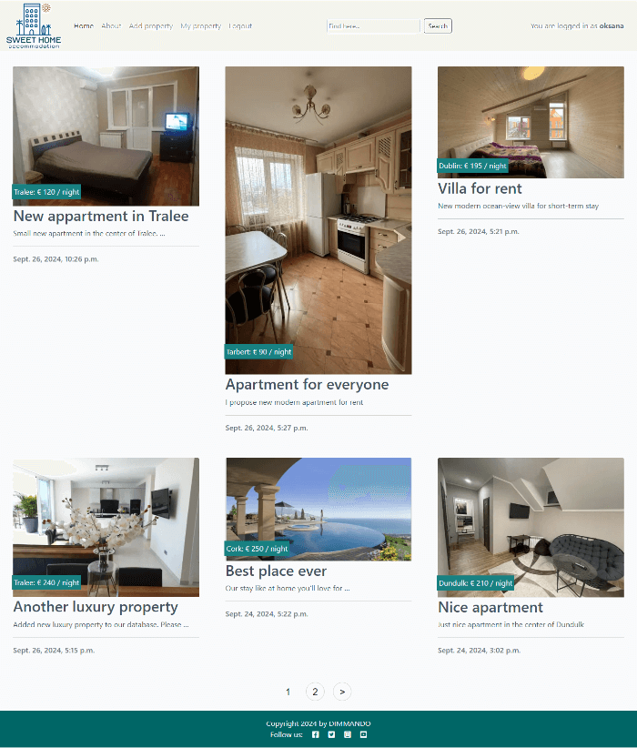
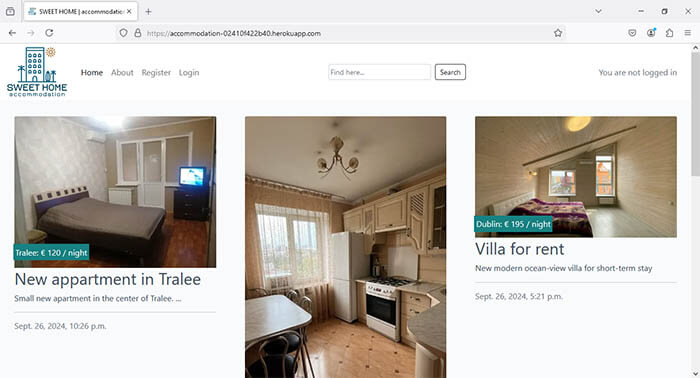
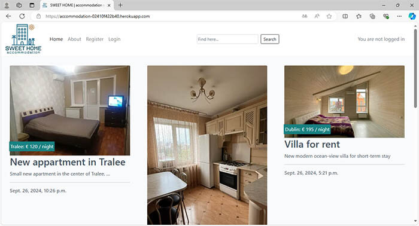
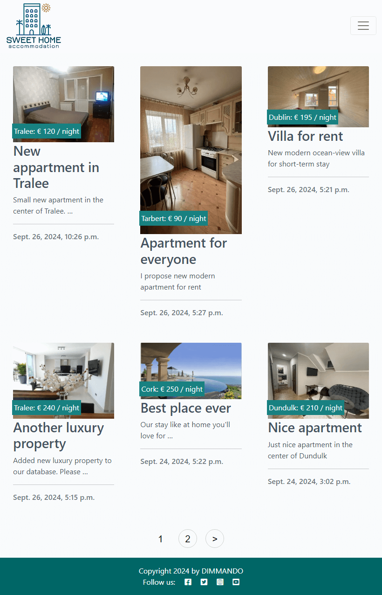
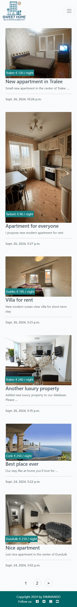
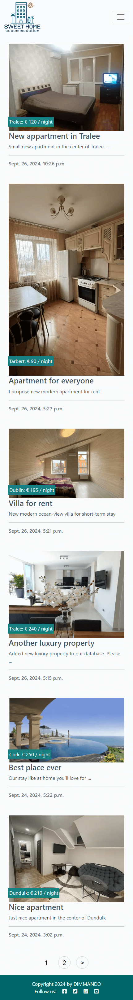
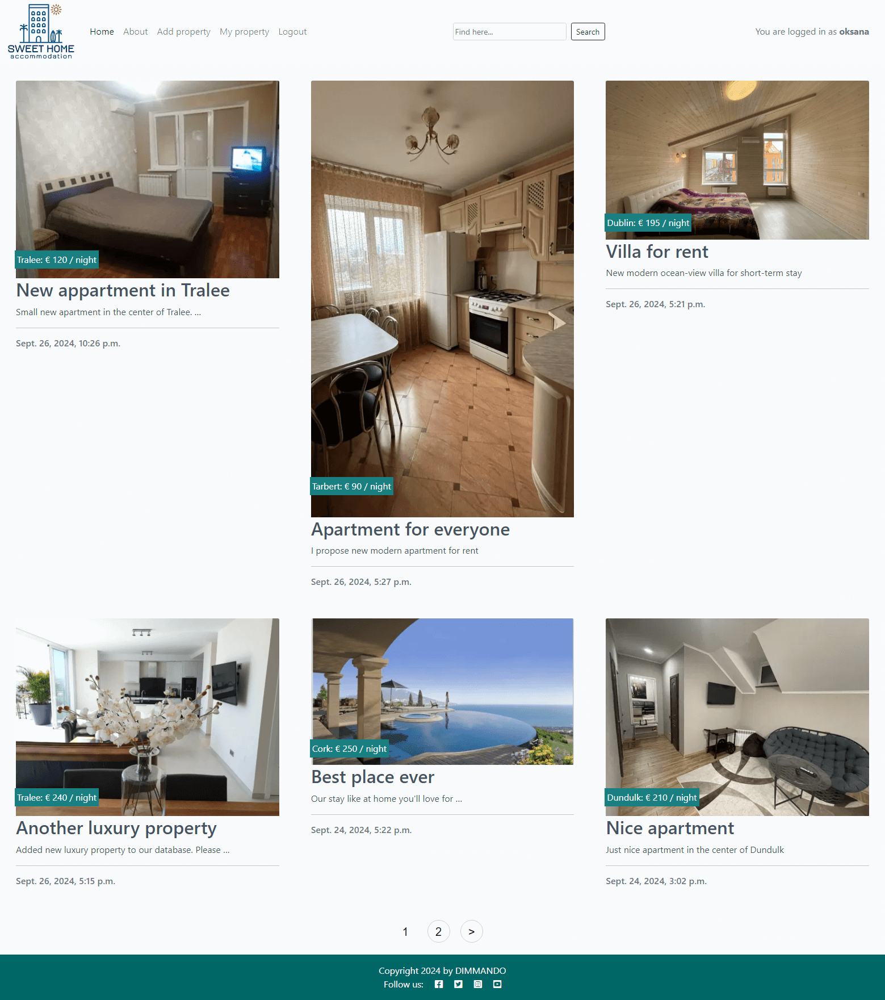
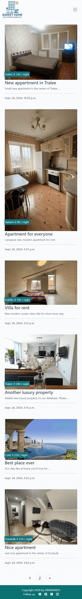
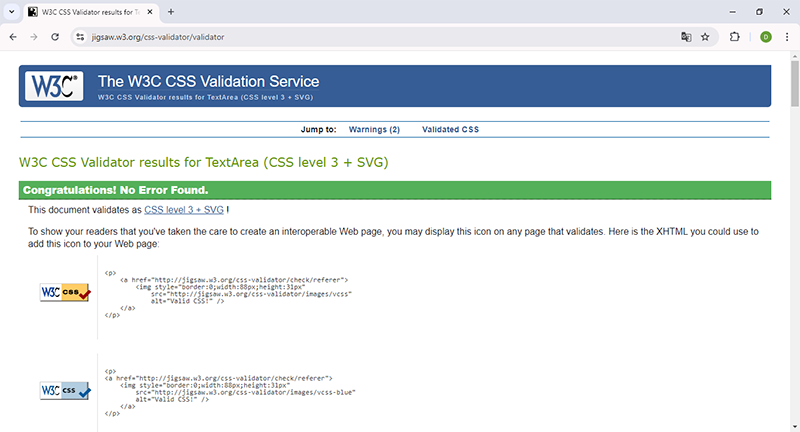
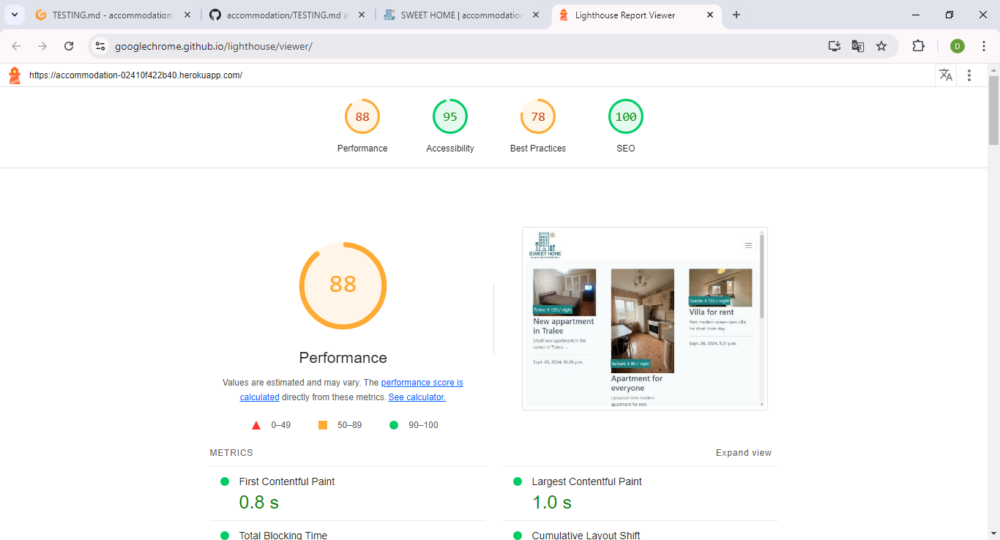

# TESTING

## Compatibility

In order to confirm the correct functionality, responsiveness, and appearance:

+ The website was tested on the following browsers: Chrome, Firefox, Edge.

    - Chrome:

    

    - FireFox:

    

    - Edge:

    

## Responsiveness

+ The website was checked by Responsive Viewer - Chrome browser extension
    - iPad-Air-5-Resolution: 820x1276
    
    
    - iPhone-14-Pro Resolution: 393x3063
    
    
    - iPhone-14-Pro-Max Resolution: 430x3229
    
    
    - Macbook-Air Resolution: 1559x1761
    
    
    - Pixel-7-Pro Resolution: 480x3461
    

+ The functionality of the SWEET HOME accommodation website was checked as well by different users.

---
## Validator testing

+ ### HTML
  Source code of all HTML-pages were tested by the official W3C validator.
  No errors or warnings were found when passing tests.
  Here is the PDF document that contains screenshots of all tests:

  [HTML Validator](documentation/html-validation.pdf)
        
+ ### CSS
  No errors or warnings were found when passing through the official W3C (Jigsaw) validator

  

+ ### JavaScript
  Small parts of JavaScript were included into html-file base.html. 
  No separated JavaScript file were used in the project.

+ ###  Python

  Source code of all custom .py-files were tested by the PEP8 Python Validator.
  No errors or warnings were found when passing tests.
  Here is the PDF document that contains screenshots of all tests:

  [Python Validator](documentation/python-valid.pdf)
  
## LightHouse report

  Using lighthouse in devtools I confirmed that the website is performing well, accessible and colors and fonts chosen are readable.
  
  
---

## Testing user stories
 
User Story |  Test | Pass
--- | --- | :---:
I want to easily understand the main purpose of the site. | I can read about type of organization and services provided on the About page. | &check;​
I want to be able easily navigate through the website | I can find the content required either by navigate pages using switchers at the bottom of the main page or using Search form at the top in navigation section. | &check;​
I want to see some details like descriptions and prices to compare it with the others. | I can see each property details as I can ckick on link under the title and short description of each property card.| &check;
I can Register on this site so I can Sign In into it and Logout from there. | I really can Register on this site by go to Register page and then I can Sign In into it and Logout from there. | &check;
As a Returning Visitor and real estate owner I can fill in a form with details about my property to propose it everyone. | I can go to Add property page, fill in a form with details about my property and submit it. | &check;
As a Returning Visitor, registered and logged in user I can see full list of my own real estate, separated by each individual property with their details. | When I registered and logged in I can go to My property page and see full list of my own real estate, separated by each individual property with their details. | &check;
As a Frequent and registered user I can edit property details added by me earlier. | I can update all info regarding each of my property pressing button Edit either on Detailed view page of my own property or into My property page choosing which exact property from the list to Edit. | &check;
As a Frequent and registered user I can delete property I added before. | I can delete each of my property separately pressing button Delete either on Detailed view page of my own property or into My property page choosing which exact property from the list to Delete. | &check;

 ### Manual Testing

 #### Welcome screen and question "Let's get started?"

Screenshot

  - I've tested that the input field for choosing "Y" or "N" takes only  letter "y", "Y", "n", "N" and nothing else and that error message is displayed to the user that warns the user of his input

 #### Check the height input 

Screenshot

   - I've tested that on prompt to user input the height only real range of height is allowed and no letters allowed. Only numbers. And that  error message is shown to the user and promt to enter real height.

 #### Check the weight input 

Screenshot

  - I've tested that on prompt to user input the weight only real range of weight is allowed and no letters allowed. Only numbers. And that  error message is shown to the user and promt to enter real weight.

 #### Conclusion screen

Screenshot

  - I've tested that the input field for choosing "Y" or "N" on conclusion screen with the question ether user wants to take test again takes only letter "y", "Y", "n", "N" and nothing else and that error message is displayed to the user that warns the user of his input.

## Bugs
+ ### Solved bugs
    Bugs were found during formatting, styling and coloring welcome description, questions and providing answers on questions. Also in formatting result for good UX.
    
        *Solutions:* refactoring print statements, debugging by isolating some functions, putting numbers and checking output only one function needed to correct.

+ ### Unsolved bugs
    None.

+ ### Mistakes
    No mistakes were found due to very simple math calculations.    
---